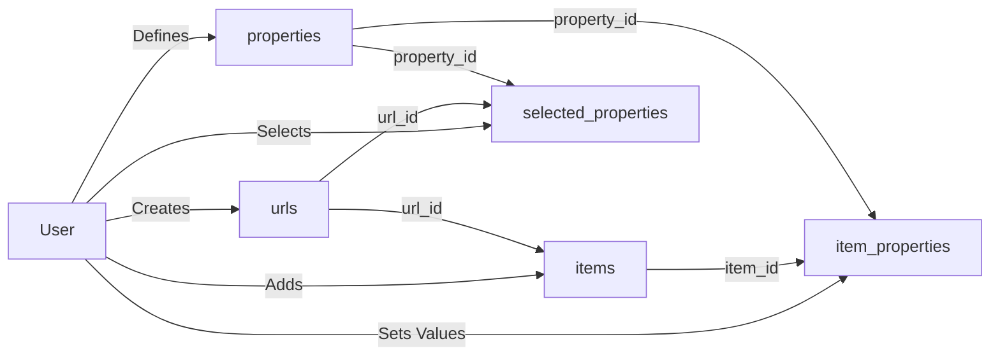

# [CompareWare](https://compareware.org/)

CompareWare is an open-source platform for comparing tools (software, hardware, etc.) with structured, crowdsourced data.
It combines Rust's **Leptos** for a modern, reactive frontend and **Nostr** for decentralized data storage (TBI).

## **Features**
- **Item Management**: Add, view, and manage items with metadata and key-value tags.
- **Nostr Integration**: 
  - Store and share data as Nostr events.
  - Authenticate users with Nostr keys.
- **Future Features**: Reviews and a Web of Trust for collaborative insights.

## **Getting Started**

### Prerequisites
- Rust (latest stable version)
- Leptos framework

### Installation
1. Clone the repository:
   ```bash
   git clone https://forge.ftt.gmbh/ryanmwangi/Compware.git
   cd compareware
   ```
2. Run the development server:
   ```bash
   cargo leptos serve
   ```
3. Open your browser at [localhost:3000](http://localhost:3000)

## **Database Schema**
### Key Concepts
- **PK (Primary Key)**: Unique identifier for table records (🔑)
- **FK (Foreign Key)**: Reference linking related tables (➡️)
- **Core (core properties)**: name and description.

### Tables Overview

| Table | Columns (PK/FK) | Description | Example Data |
|-------|------------------|-------------|--------------|
| **urls** | `id` (PK), `url`, `created_at` | Stores comparison URLs | `1, "/laptops", 2024-03-01` |
| **items** | `id` (PK), `url_id` (FK), `wikidata_id` | Comparison items | `"item1", 1, "Q214276"` |
| **properties** | `id` (PK), `name` | All available properties (including core) | `1.0, "name"`<br>`2.0, "description"`<br>`3.0, "screen_size"` |
| **item_properties** | `item_id` (PK/FK), `property_id` (PK/FK), `value` | All property values including name/description | `"item1", 1.0, "MacBook Pro"`<br>`"item1", 2.0, "16-inch laptop"`<br>`"item1", 3.0, "16 inches"` |
| **selected_properties** | `url_id` (PK/FK), `property_id` (PK/FK) | Active properties per URL (excludes core) | `1, 3.0` |

### Data Flow

## **Docker Deployment**

### **Prerequisites**
- Docker installed on your system
- Docker Compose (usually included with Docker Desktop)

### **Running with Docker**
1. Clone the repository:
   ```bash
   git clone https://forge.ftt.gmbh/ryanmwangi/Compware.git
   cd compareware
   ```
2. Start the container:
   ```bash
   docker-compose up -d
   ```
3. Access the application at: [http://localhost:3000](http://localhost:3000)

### **Collaboration**
We welcome contributions! Here’s how you can help:

### 1. **Contribute Code**
   - Fork the repository and create a new branch for your feature or fix.
   - Ensure your changes are well-tested and include documentation if necessary.
   - Open a **pull request** describing the changes and why they are useful.

### 2. **Report Issues**
   - If you encounter bugs or have suggestions, please open an issue on the [Issues page](https://forge.ftt.gmbh/ryanmwangi/Compware/issues).
   - Provide as much detail as possible, including steps to reproduce the issue and relevant error messages.

### 3. **Feature Suggestions**
   - We are constantly looking to improve CompareWare. If you have ideas for new features, please share them in the Issues section.
   - You can also help us prioritize future work by commenting or upvoting on existing feature requests.

### 4. **Documentation Contributions**
   - If you spot areas in the documentation that need improvement or if you have suggestions for clearer explanations, please feel free to submit a pull request with the updates.
   - Helping others understand the project is just as valuable as contributing code!

### 5. **Community and Discussion**
   - Feel free to ask questions, provide feedback, or engage in discussions related to CompareWare’s development.

### 6. **Test and Review**
   - Help by reviewing pull requests to ensure the code meets our standards and is bug-free.
   - Test new features and provide feedback to improve their functionality and usability.

We appreciate any contributions that can help improve CompareWare and make it more useful for the community!

